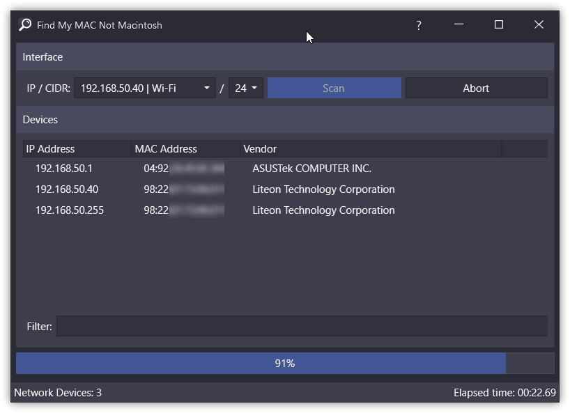

# Find my MAC not Macintosh
Wanna just find your devices on LAN without any knowledge of ARP protocol and things like that? Well **"Find My Mac Not Macintosh"** can help you with that! Just crack your fingers, download latest release of this program and then use your BFU skills to press one frickin button!

It's that ez ...

# Download
✅ https://github.com/M0n7y5/findmymacnotmacintosh/releases/latest

## Main features (aka buzzwords):
- It can recognize Vendor from MAC
- You can filter found devices by MAC, IP and Vendor
- *Smol* size (only 3.2MB)
- It can scan Full CIDR /0
- No need for WinCap driver etc.
- It's **fast** *(can scan  /24 in 25 sec and less, depends on router)*
- Easy to use!
- And most importantly ... **IT HAS DARK MODE!!!** 

## Used tools & technologies 
- .Net Core 3.1
- AMC Patcher
    - https://github.com/TAbdiukov/AMC_patcher-CLI
- Warp (packer)
    - https://github.com/dgiagio/warp
- Resource Hacker
    - http://www.angusj.com/resourcehacker/
- Adonis UI
    - https://github.com/benruehl/adonis-ui
- Reactive UI
    - https://github.com/reactiveui/ReactiveUI
- etc ;)

# Contribution
I'll be glad for any contribution & pull requests